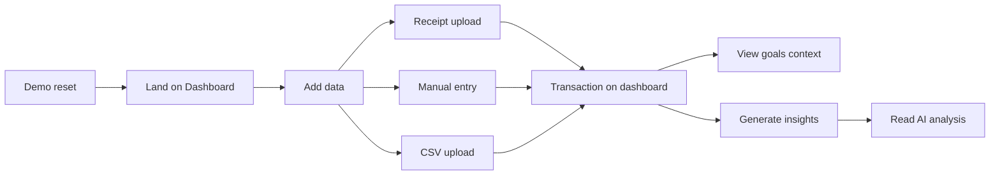

# Financial App — Initial Official Release (IOR) v1

**Document ID:** `financial_app_ior_v1`  
**Project:** Financial App (Financial Nebula Node)  
**Release branch:** `deployable`  
**Status:** Definition — not yet validated as PAPE  
**Last updated:** ACI-IOR-01

---

## 1. Purpose

IOR v1 defines the first **customer-facing, demonstrable** version of the Financial App: a web-based tool that helps an individual capture financial activity, optionally from receipts and CSV, and receive **AI-generated behavioral financial insights** grounded in their transaction history.

IOR v1 is scoped for:

- Live demo over HTTP (SPE-01 / container deployment)
- Operator-led validation (PE checklist)
- Future feature ACIs branched from `deployable`

IOR v1 is **not** a full personal finance product, bank-connected platform, or multi-user SaaS.

---

## 2. Target User

| Attribute | Description |
|-----------|-------------|
| **Primary user** | Individual operator or demo participant evaluating AI-assisted personal finance |
| **Technical level** | Comfortable using a browser; no CLI required for normal use |
| **Environment** | Single-user, single-tenant demo instance |
| **Data expectation** | Local persistence on the server; no shared cloud account |

---

## 3. User Journey (IOR v1)

1. User opens the app URL and sees the **Dashboard** (transactions + goals context).
2. User adds financial data via **receipt**, **manual entry**, or **CSV**.
3. User reviews transactions on the dashboard.
4. User opens **Insights** and requests AI analysis of current transactions.
5. Operator may **reset demo data** before the next session (IOR requirement — see §6).

---

## 4. Screen Inventory

| Screen | Route | IOR v1 status |
|--------|-------|---------------|
| Dashboard | `/` | **Required** — exists |
| Upload receipt | `/upload_receipt` | **Required** — exists |
| Upload CSV | `/upload_csv` | **Required** — exists |
| Add transaction | `/add_transaction` | **Required** — exists |
| Behavioral insights | `/insights` | **Required** — exists |
| Preflight error | error template | **Required** — exists |
| Transaction edit | — | **Out of scope** v1 |
| Transaction delete | — | **Out of scope** v1 (see management note) |
| Goals management | — | **Display only** v1 |
| Demo reset | — | **Required** — **missing** (must implement) |
| Login / register | — | **Not IOR** |

---

## 5. Data Objects

### 5.1 Transaction

| Field | Type | Required | Notes |
|-------|------|----------|-------|
| `id` | string (UUID) | Yes | Auto-generated if missing |
| `merchant` | string | Yes | From form, CSV, or receipt parse |
| `amount` | string (decimal) | Yes | Normalized to two decimal places |
| `category` | string | Yes | Default `uncategorized` |
| `date` | string (ISO) | Yes | Default UTC now if omitted |
| `note` | string | No | Optional context |

**Storage:** `data/transactions.json` (local JSON file).

### 5.2 Goal (display context)

| Field | Type | IOR v1 |
|-------|------|--------|
| `id` | string | Static demo goal acceptable |
| `name` | string | Shown on dashboard |
| `target` | number | Shown on dashboard |
| `description` | string | Shown on dashboard |

**Current implementation:** Hardcoded default goal in `get_default_goals()` — `goals.json` path exists but is **not** loaded/saved.

**IOR v1 acceptance:** At least one visible goal on dashboard; full goal CRUD is **not** required for v1.

### 5.3 Receipt upload (transient)

- Stored under `uploads/` until parsed.
- Parsed fields merged into a new transaction; file may remain on disk.

### 5.4 Configuration (runtime)

- `config.json` / mounted config in Docker
- `OPENAI_API_KEY` or `openai.api_key_file` for AI features

---

## 6. Required Features (IOR v1)

Features **must** work for IOR to be declared achieved (PAPE).

| # | Feature | Description | Current state |
|---|---------|-------------|---------------|
| R1 | **Dashboard** | List all transactions; show goals context; navigation | **Exists** |
| R2 | **Manual transaction entry** | Form: merchant, amount, category, date, note | **Exists** |
| R3 | **CSV transaction upload** | Header-aware CSV ingest, multiple rows | **Exists** |
| R4 | **Receipt upload** | Image upload (png, jpg, jpeg, webp); size/format validation | **Exists** |
| R5 | **Receipt parsing (AI)** | OpenAI vision extracts merchant, amount, date, category | **Exists** (`OpenAIReceiptParsingService`) |
| R6 | **Transaction normalization** | Consistent schema for all ingest paths | **Exists** |
| R7 | **AI financial insight generation** | OpenAI text analysis from transaction set | **Partial** — exists; must validate on deployable runtime (SDK compatibility) |
| R8 | **Financial goals (display)** | At least one goal visible on dashboard | **Partial** — static default goal only |
| R9 | **Demo reset** | Clear transactions (and optionally uploads) for clean demo | **Missing** — **must implement** |
| R10 | **Preflight / error handling** | Clear failure if config or API key missing | **Exists** |
| R11 | **Professional UI** | Readable MVP theme, nav, flash messages | **Exists** |
| R12 | **Deployable artifact** | Docker image `taig2k/finance_app_for_aws` on `deployable` | **Exists** (CI/CD) |

### 6.1 Transaction management (IOR v1 minimum)

| Capability | IOR v1 |
|------------|--------|
| Add transactions | **Required** (all paths) |
| View transactions on dashboard | **Required** |
| Edit transaction | **Excluded** v1 |
| Delete single transaction | **Excluded** v1 (demo reset covers bulk clear) |

---

## 7. AI Functionality (IOR v1)

| Capability | Model | IOR requirement |
|------------|-------|-----------------|
| Receipt vision parse | `gpt-4o-mini` (configurable) | Must return structured fields; safe JSON parse; fallback on failure |
| Behavioral insights | `gpt-4o-mini` (configurable) | Must produce readable insight text when API key valid |
| Heuristic fallback | N/A | Allowed when OpenAI unavailable; must be labeled as non-AI in UI |

**IOR validation criteria (AI):**

- [ ] Receipt image → transaction with plausible merchant and amount
- [ ] Insights page → non-heuristic insight when `OPENAI_API_KEY` set on PE
- [ ] No API keys in logs, UI, or git
- [ ] Errors logged with category; user sees flash or error page

**Known technical note:** `OpenAIService.generate_insights` uses legacy `ChatCompletion.create`; receipt parsing uses modern SDK. IOR validation must confirm insights work in deployed container or schedule fix in a pre-IOR feature ACI.

---

## 8. Excluded Features (NOT IOR)

Explicitly **out of scope** for IOR v1:

| Category | Examples |
|----------|----------|
| **Integrations** | Bank feeds, Plaid, credit card sync, OAuth providers |
| **Monetization** | Subscriptions, billing, payments |
| **Multi-user** | Accounts, roles, teams, shared households |
| **Platforms** | Native mobile app, desktop app |
| **Infrastructure product** | Serverless-only rewrite, Kubernetes platform, multi-region |
| **Advanced analytics** | Forecasting, budgeting engines, tax reporting, portfolio tracking |
| **Security product** | MFA, SSO, encryption-at-rest product story beyond PE demo |
| **Data platform** | PostgreSQL/RDS, Redis, S3 archival (SPE-01 uses local JSON only) |
| **Collaboration** | Comments, sharing, export to accounting systems |
| **Content** | News, stock tickers, market data |
| **Full goals product** | User-created goals, progress bars, goal-linked AI coaching |
| **Transaction CRUD UI** | Edit/delete individual rows (deferred; reset only) |
| **HTTPS / custom domain** | Optional for PE; not required for IOR definition |
| **PAPE declaration** | Separate governance gate after PE validation |

---

## 9. Recommended IOR v1 Scope (Practical)

### 9.1 Ship as-is (document + validate)

- Dashboard, navigation, styling
- Manual entry, CSV upload, receipt upload
- OpenAI receipt parsing (vision)
- Local JSON persistence
- Preflight and flash messaging
- Static goal display on dashboard

### 9.2 Must implement before IOR sign-off

| Priority | Feature | Rationale |
|----------|---------|-----------|
| **P0** | Demo reset | Required for repeatable demos; listed in IOR candidates |
| **P0** | Validate AI insights on `deployable` / Docker | Core value proposition; may need SDK alignment |
| **P1** | Receipt parser: honor `OPENAI_API_KEY` env var | Align with SPE-01 bootstrap (file-only today in receipt service) |

### 9.3 Defer past IOR v1

- Transaction edit/delete UI
- Persistent user-defined goals (`goals.json` CRUD)
- Goal progress / correlation math
- Export PDF/CSV
- User authentication

---

## 10. Validation Criteria (IOR / PAPE Gate)

IOR is **defined** by this document. **PAPE** requires PE validation per `terraform/spe-01/VALIDATION.md` plus:

| ID | Criterion |
|----|-----------|
| V1 | App loads at public URL after SPE-01 start |
| V2 | Manual transaction → appears on dashboard |
| V3 | CSV upload → multiple transactions ingested |
| V4 | Receipt upload → AI-parsed transaction (or documented fallback with operator awareness) |
| V5 | Insights → AI-generated text (not heuristic-only) with valid API key |
| V6 | Demo reset → transactions cleared; dashboard empty |
| V7 | Goals section visible on dashboard |
| V8 | No regressions in CI (`pytest` + Docker build on `deployable`) |
| V9 | Docker image published from `deployable` |

---

## 11. Relationship to Deployment

| Artifact | Role in IOR |
|----------|-------------|
| `deployable` branch | Source of truth for release |
| `taig2k/finance_app_for_aws:latest` | Runtime image for PE/demo |
| SPE-01 Terraform | Optional hosting; not part of IOR feature set |
| `config.json` / env secrets | Runtime configuration |

---

## 12. Document Control

| Version | Branch | Notes |
|---------|--------|-------|
| 1.0 | `feature/ior-release-definition` | Initial IOR definition (ACI-IOR-01) |

**Next:** Feature ACIs implement P0 gaps, then PE validation, then PAPE decision.
